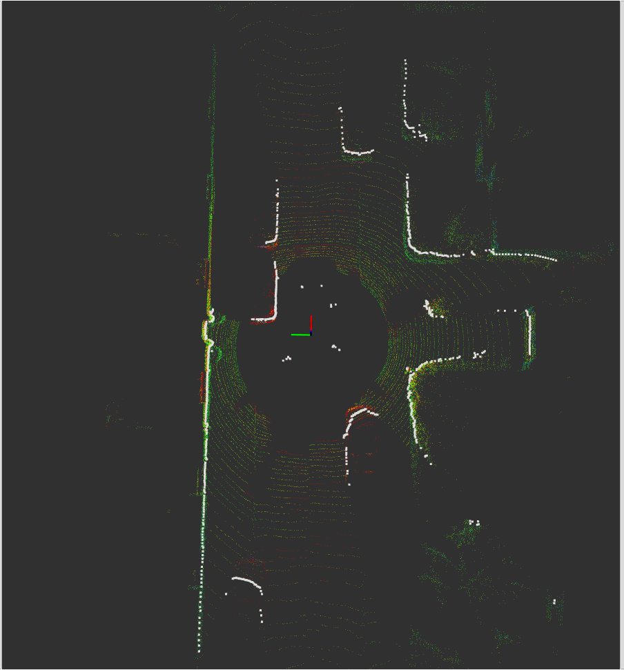

# pc2_to_laserscan

ROS2 package (C++) that subscribes to `sensor_msgs/PointCloud2`, converts it into a `sensor_msgs/LaserScan`, and publishes the scan.

## Features
- C++ node: `pc2_to_laserscan_cpp`
- All parameters configurable via `config/params.yaml`
- Launch file: `launch/pc2_to_laserscan_launch.py`


## Installation and build
```bash
# in ROS2 workspace src
git clone <this_package> 
cd ..
colcon build
source install/setup.bash
ros2 launch pc2_to_laserscan pc2_to_laserscan_launch.py
```

## Demo Video

You can watch a short demo recorded in RViz showing the point cloud to laser scan conversion:

[](data/laserscan_video.webm)


